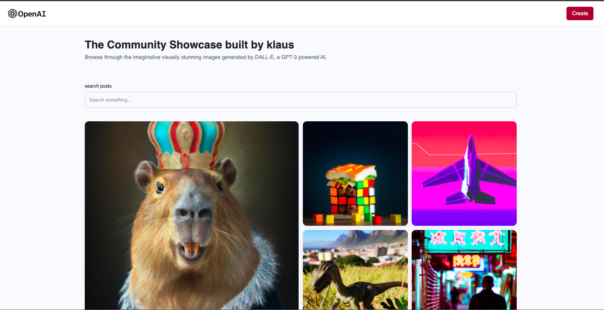
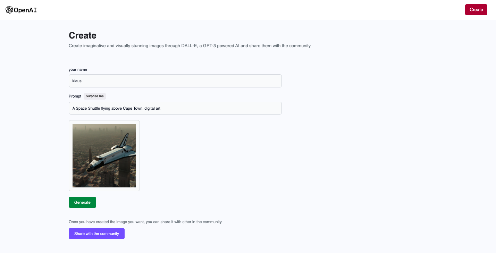

# A application that consumes the openAI API and generates a dynamic image which the user can download.
# It was made using vite and openai api.
you can clone the repo
cd server
npm install
cd client
npm install

  
  
 

